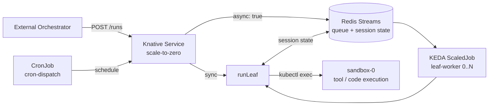

# Serverless Harness

**Run stateful AI coding agents serverless — scale to zero between turns, resume exactly where they left off.**

-success>)


Serverless Harness turns a long-lived AI agent into a **scale-to-zero workload** on Kubernetes.
An agent process normally has to stay resident — holding its conversation, tool state, and working
directory in memory — even while it sits idle waiting for the next turn or for a human to approve a
step. That idle time is pure cost. The harness decouples the agent's **state** (durable in Redis)
and its **tool execution** (an isolated sandbox pod) from the **agent process** itself, so the agent
runs as a Knative service that drops to zero pods when idle and cold-starts with full session
continuity on the next request.

The result is a **leaf-session backend**: an external orchestrator dispatches isolated units of agent
work ("leaves") over a simple HTTP + shared-volume contract, and the harness runs each one
sync, async (queued), scheduled, or paused-for-approval — all on infrastructure that costs nothing at
rest.

## Table of Contents

- [Why](#why)
- [Architecture](#architecture)
- [Features](#features)
- [Quick Start](#quick-start)
- [Deploy on OpenShift](#deploy-on-openshift)
- [How It Works](#how-it-works)
- [Dispatch Archetypes](#dispatch-archetypes)
- [Repository Layout](#repository-layout)
- [Evidence](#evidence)
- [Roadmap](#roadmap)
- [Documentation](#documentation)
- [Status & License](#status--license)

---

## Why

| Persistent agent                                    | Serverless Harness                                                    |
| --------------------------------------------------- | --------------------------------------------------------------------- |
| Process stays resident between turns                | Scales to **zero** when idle, cold-starts in sub-second               |
| State lives in process memory — lost on crash/evict | State lives in **Redis** — survives eviction, restart, and cold start |
| Tools execute in the agent process                  | Tools execute in an **isolated sandbox pod** (brain/hands split)      |
| Idle compute billed continuously                    | **Only Redis + sandbox** stay resident (2 pods at rest)               |
| One invocation model                                | **Four**: sync, async fan-out, scheduled, human-gated                 |

In an idle-heavy workload [experiment](https://github.com/rossoctl/moca-experiments/blob/main/knative/EXPERIMENTS.md), the serverless path consumed
roughly **a quarter** of the pod-seconds of an equivalent always-on agent — because the expensive
part (the agent process) exists only while a turn is actively running.

---

## Architecture



| Component           | Role                                                                                  |
| ------------------- | ------------------------------------------------------------------------------------- |
| **Knative Service** | Scale-to-zero HTTP endpoint; runs a turn inline (sync) or enqueues it (async)         |
| **Redis**           | Durable session state (resume by `sessionId`), work queue (Streams), gate state       |
| **KEDA ScaledJob**  | Autoscales `leaf-worker` pods 0→N on queue depth (`lagCount` + `pendingEntriesCount`) |
| **sandbox-0**       | Persistent pod where all tool/code execution runs; reached via `kubectl exec`         |
| **Shared PVC**      | Volume-envelope contract — inputs, results, and markers travel as files               |
| **CronJob**         | Scheduled dispatch (`cron-dispatch`) for periodic batch work                          |

> **Note:** The Knative Service and the `leaf-worker` are the **same container image** with two entry
> points (`server.ts` vs `leaf-job.ts`). Both converge on `runLeaf()`, which routes execution into
> `sandbox-0`. The "brain" (model inference + session logic) runs in whichever pod called `runLeaf()`;
> the "hands" (actual command/tool execution) always run in the sandbox.

---

## Features

- **Scale-to-zero turns** — Knative drops the agent to zero pods between turns; the activator
  cold-starts a fresh pod on the next request.
- **Durable resume** — sessions are append-only logs in Redis; a cold-started pod recalls full
  conversation and state by `sessionId`, surviving pod eviction.
- **Brain/hands isolation** — the agent never executes tools in its own process; everything runs in a
  separate hardened `sandbox-0` pod via a persistent in-pod channel.
- **Four dispatch modes** — one `/runs` endpoint serves sync, async-queued, cron-scheduled, and
  human-gated execution (see [Dispatch Archetypes](#dispatch-archetypes)).
- **Human-in-the-loop gates** — a leaf can pause mid-run, report `awaiting_approval`, and resume on an
  external approve/reject/abort verdict — scaling to zero while it waits.
- **Volume-envelope contract** — orchestrators pass inputs and collect results as files on a shared
  PVC, decoupling result size from HTTP limits.
- **Hardened by default** — non-root UID, read-only root filesystem, all capabilities dropped,
  `RuntimeDefault` seccomp, no service-account token automount.
- **Built on Pi** — wraps a pinned [`kagenti/pi`](https://github.com/kagenti/pi) coding agent through
  an injectable `SessionStorageBackend` seam; the agent itself is unmodified.
- **Promote a local Claude Code workflow** — `cd harness && pnpm promote` bundles skills, `CLAUDE.md`,
  memory, and a slash command from your local `~/.claude` into a content-addressed bundle a leaf can
  dispatch by digest (see [Promoting a local Claude Code workflow](#promoting-a-local-claude-code-workflow)).

---

## Quick Start

Bring up the full stack on a local [Kind](https://kind.sigs.k8s.io/) cluster and drive an agent that
scales to zero and resumes from cold — no local image build required.

> **Prerequisites:** `kind`, `kubectl`, `docker`, and an Anthropic-compatible model credential.

```bash
git clone --recurse-submodules https://github.com/rossoctl/serverless-harness.git
cd serverless-harness

export ANTHROPIC_API_KEY=sk-...    # ...or a gateway: ANTHROPIC_BASE_URL + ANTHROPIC_AUTH_TOKEN

./deploy/knative/setup-kind.sh     # installs Knative + Kourier, Redis, the sandbox, and KEDA
```

`setup-kind.sh` **pulls the published image** (`ghcr.io/rossoctl/serverless-harness:latest`) by
default, so a first run needs no local Docker build. The default model is `claude-haiku-4-5` (fast and
cheap — ideal for a live demo).

**Next — take the guided tour:**
[`docs/demos/serverless-harness-demo.md`](docs/demos/serverless-harness-demo.md) is a ~10-minute,
two-act walkthrough where you watch the agent **cold-start from zero, drop back to zero and resume
with full memory** (Act 1), then **fan out into a fleet of worker pods** that appear on demand and
vanish when the queue drains (Act 2). It's the fastest way to see what a serverless agent does that
an always-on one can't.

**Then — the remote sandbox:**
[`docs/demos/remote-sandbox-demo.md`](docs/demos/remote-sandbox-demo.md) drives a sandbox running as
a plain `docker run` **on your laptop** — outside the cluster, with **zero inbound rules** and no
cluster credential — executing a leaf's tool calls. Same request, opposite verdicts, and a secret you
plant by hand that the cluster reads back. Scripted equivalent: `make demo-remote-sandbox`.

All guided demos are indexed in [`docs/demos/`](docs/demos/).

For setup options and troubleshooting see
[`deploy/knative/README-kind.md`](deploy/knative/README-kind.md);
[`deploy/knative/SMOKE.md`](deploy/knative/SMOKE.md) documents the verified smoke-test claims.

---

## Deploy on OpenShift

For OpenShift (4.20+), use [`deploy/knative/setup-ocp.sh`](deploy/knative/setup-ocp.sh) — the
OpenShift-native sibling of `setup-kind.sh`. It installs OpenShift Serverless (Knative + Kourier)
via the Red Hat operator, deploys Redis, the sandbox, the PVC and the harness Knative Service, and
exposes it over an auto-created **OpenShift Route** (no port-forward).

```bash
oc login ...                       # cluster-admin on OpenShift 4.20+
export ANTHROPIC_API_KEY=sk-...    # or the gateway vars above
./deploy/knative/setup-ocp.sh      # add --dry-run to preview, --with-keda for async leaf
```

The full guide — prerequisites, flags, storage/SCC notes, smoke testing over the Route, and
troubleshooting — is in **[`deploy/knative/README-ocp.md`](deploy/knative/README-ocp.md)**.

---

## How It Works

1. **An orchestrator POSTs a leaf** to `/runs` (or `/turn` for a single interactive turn).
2. The **Knative Service** wakes from zero, and either runs the leaf inline (`sync`) or pushes the
   envelope onto **Redis Streams** and returns `202` (`async: true`), then idles back to zero.
3. For async work, a **KEDA ScaledJob** scales `leaf-worker` pods up on queue depth and drains items.
4. Both paths call **`runLeaf()`**, which executes all tools inside **`sandbox-0`** via `kubectl exec`.
5. **Session state streams to Redis** as it goes, so the leaf is resumable by `sessionId` even if its
   pod dies mid-run.
6. **Results land as files** on a shared PVC, and a **done-marker** signals completion to the
   orchestrator.

---

### Promoting a local Claude Code workflow

Iterate on a workflow locally in Claude Code — skills, `CLAUDE.md`, memory, a slash command — then
promote it from inside Claude Code, in the project you want to promote:

```bash
mkdir -p ~/.claude/commands                                    # once
cp deploy/claude/commands/promote.md ~/.claude/commands/       # once
export SH_HARNESS_DIR=/path/to/serverless-harness              # once, per shell

# launch with the CLI granted at session level, so the grant outlives the command's own turn
claude --allowedTools "Bash(pnpm --dir $SH_HARNESS_DIR/harness promote:*)"

/promote my-workflow                                           # in any project, from Claude Code
```

The command's `allowed-tools` frontmatter grants the CLI for the turn the slash command creates. That
is enough when the promotion completes in that turn; if the turn ends first — an interruption, or a
guard that stops to ask — the grant is gone and the next turn's `pnpm` call is refused, since a
default install has no `pnpm` rule. The launch flag above avoids that, stays narrow (only the
`promote` script, only in that checkout), and needs no change to your settings. The equivalent
permanent form is the same rule in `permissions.allow`, with the path written out — a `*` inside the
pattern matches nothing.

`/promote` passes `--home` and `--project` for you, checks that the repo boundary and the Redis
tunnel are right before uploading, and reads the digest back through the cluster's own client
afterwards. It writes every path out in full, with no `$VAR` and no `HOME=… pnpm …` prefix, because
Claude Code will only match a command against `allowed-tools` if it can analyse it statically —
otherwise the command needs a permission prompt at best, and under `defaultMode: dontAsk` or `auto`
it is refused outright.

Installed in your **real** `~/.claude/commands/` as above, it is visible in every project and never
travels. You can instead keep it **in the project**, which lets you run Claude Code with
`HOME=<project>` so the local agent sees exactly what the promoted run will; `/promote` then detects
that it lives there and self-excludes with `--exclude-prompt promote` (see below), because otherwise
it would ship itself into every bundle.

Or drive the CLI directly:

```bash
cd harness && pnpm promote --entry my-workflow --project /path/to/your/project
```

`promote` reads the workflow — skills, `CLAUDE.md` chain, and memory — from `--project`, so
running it from the harness checkout without `--project` promotes the harness's own
configuration, not yours.

`--home <dir>` reads _user_ scope (skills, memory, prompts) from `<dir>/.claude` instead of your real
`$HOME`, and `--redis-url <url>` names the Redis to upload to. Both override the corresponding env
var (`HOME`, `REDIS_URL`) and produce a byte-identical bundle to it; they exist as flags so the whole
invocation can be one statically analyzable command, which is what `/promote` needs to run without a
permission prompt. The CLI prints the user scope it resolved, so you can see which one applied.

`promote` dedupes and classifies your local configuration, drops what cannot work in the harness
(with a reason for each), and scans for credentials before uploading. The scan has two tiers: a
structural match on a known key shape (an AWS access key, a PEM private-key block, a GitHub or
Slack token, an OpenAI-style key) **refuses the upload** and exits non-zero; a weaker prose
heuristic (`token: <value>`-shaped lines) only **warns and proceeds**, leaving the judgement to
you — that heuristic matches code and documentation placeholders too often to block on safely. It
writes a committable `.claude/promoted.lock.json` and uploads a content-addressed bundle; an
unchanged re-promotion uploads nothing.

Keep a prompt out of the bundle with `--exclude-prompt <name>`, repeatable. This exists for the
case where the command that _drives_ promotion lives in the project being promoted: with user scope
pointed at that project, its `.claude/commands/` is the prompts directory, so without the flag such
a command ships itself into every bundle. Excluding the entry prompt is refused outright, and an
exclusion that matches nothing warns — an unmatched exclusion would otherwise ship the prompt you
meant to omit.

Dispatch it by adding one field to any prompt leaf:

```json
{ "sessionId": "run-1/item-1", "kind": "prompt", "prompt": "…", "configRef": "sha256:…" }
```

Memory travels **read-only** — a promoted run consumes what you taught it locally and reports
discoveries back in the leaf result, which keeps leaf replay reproducible
([ADR-0031](docs/adrs/0031-promoted-memory-read-only.md)). MCP servers and subagents are not
promoted; see the [design](docs/specs/2026-09-02-claude-code-workflow-promotion-design.md) §2, §9.

---

## Dispatch Archetypes

The same backend serves three orchestration patterns, all validated end-to-end on Kind:

| Archetype             | Pattern                                                                 | Example use case                                     |
| --------------------- | ----------------------------------------------------------------------- | ---------------------------------------------------- |
| **A — Async fan-out** | `{async:true}` → Redis Streams → KEDA scales workers 0→N → done-markers | "Research 10 topics concurrently"                    |
| **B — Human gate**    | Leaf pauses → `awaiting_approval` → external verdict → resume/terminate | "Draft a clause, pause for legal sign-off, finalize" |
| **C — Scheduled**     | CronJob → `cron-dispatch` reads a config list → posts each as async     | "Summarize yesterday's tickets at 02:00 daily"       |

---

## Repository Layout

```text
serverless-harness/
├── packages/
│   ├── session-backend/   # Generic append-only LogStore + Redis Streams impl
│   ├── k8s-sandbox/       # Routes Pi tool execution to a remote pod (kubectl exec)
│   ├── knative-server/    # HTTP server (server.ts) + leaf-worker (leaf-job.ts) entry points
│   └── work-queue/        # Redis Streams work queue (async dispatch)
├── harness/               # Pi SessionStorageBackend adapter (write-behind) + headless smoke
├── pi-fork/               # Pinned Pi coding agent (submodule) with the injectable backend seam
├── deploy/knative/        # Kind setup, manifests, smoke (experiment drivers moved to
│                          # rossoctl/moca-experiments, 2026-09-25)
└── docs/specs/            # Design specs (per-milestone) + milestone registry
```

---

## Evidence

Behaviour and economics are backed by reproducible experiments rather than claims:

- **[`moca-experiments/knative/EXPERIMENTS.md`](https://github.com/rossoctl/moca-experiments/blob/main/knative/EXPERIMENTS.md)**
  — cluster experiments E1 (economics), E3 (mobility), E4 (recovery), run live on Kind. Moved to
  a separate repo 2026-09-25 (see `docs/specs/2026-09-24-ra1-density-cutover-and-repo-rearchitecture-design.md`).
- **[`docs/experiment-results.md`](docs/experiment-results.md)** — E2 (reconstruction cost) and E5
  (budget enforcement); the `@sh/experiments` workspace these ran from moved to
  [`moca-experiments/experiments/`](https://github.com/rossoctl/moca-experiments/tree/main/experiments)
  on 2026-09-25 (see `docs/specs/2026-09-24-ra1-density-cutover-and-repo-rearchitecture-design.md`).
- **[`deploy/knative/SMOKE.md`](deploy/knative/SMOKE.md)** — the 6/6 cold-start + resume smoke claims.

---

## Roadmap

**Phase 1 — Decoupled Harness (built):** Redis session backend, remote sandbox client, persistent
in-pod channel, Knative wrapper, compaction-checkpoint fast path, experiments, and the leaf-session
backend with all three dispatch archetypes. See the
[milestone registry](docs/specs/README.md) for the source-of-truth status of every milestone.

**Phase 2 — Zero-Trust Credential Plane (design complete, deferred):** a credential plane where
_no component influenced by model output ever holds a raw secret._

| ID  | Adds                                                                  |
| --- | --------------------------------------------------------------------- |
| Z1  | Per-session SPIFFE identity (SPIRE)                                   |
| Z2  | Secret-free, default-deny harness lock-down                           |
| Z3  | Inference injector — provider-key chokepoint, mTLS to the LLM gateway |
| Z4  | MCP code-mode in the sandbox                                          |
| Z5  | Generalized credentialed egress (sandbox forward proxy)               |
| Z6  | Subagents as isolated child sessions                                  |
| Z7  | Red-team + formal validation of the credential plane                  |

Today the harness uses a trust-the-operator model: the model credential is a pre-provisioned
Kubernetes Secret, there is no egress policy, and all leaves share one service-account identity. Those
gaps are exactly what Phase 2 closes.

---

## Documentation

- [Glossary](docs/glossary.md) — canonical `session`/`turn` vocabulary; why `run` isn't a harness concept
- [Deploy on OpenShift](deploy/knative/README-ocp.md) — `setup-ocp.sh` install guide (OCP 4.20+)
- [Executive overview — leaf-session backend](docs/executive-overview-leaf-session.md)
- [Milestone registry](docs/specs/README.md) — authoritative milestone numbering and status
- [Design specs](docs/specs/) — one dated design doc per milestone
- [`harness/README.md`](harness/README.md) — local dev build (Pi workspace build order, headless smoke)

---

## Status & License

This is explorative work. It is an MVP — the scale-to-zero, durable-resume, sandbox-isolation,
and dispatch features above are built and smoke-verified; the zero-trust credential plane is
designed but not yet implemented. Interfaces may change.

Licensed under the [Apache License 2.0](LICENSE).
