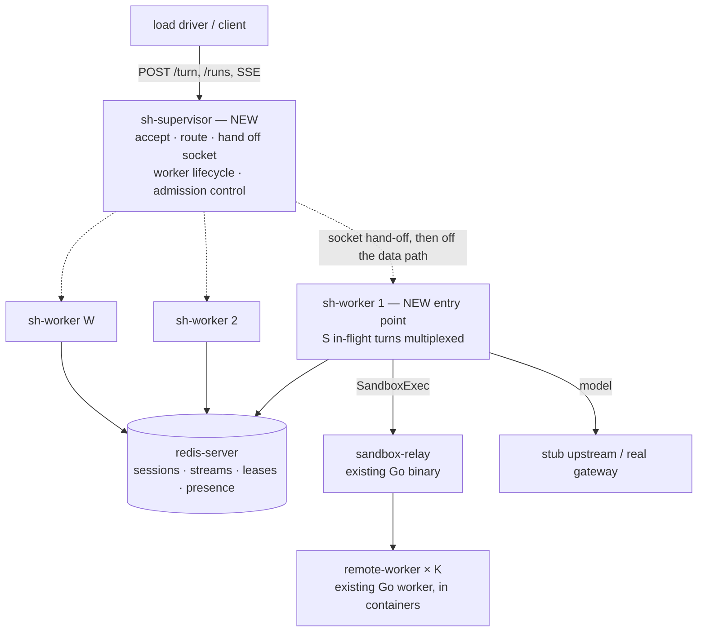

# P6 — VM Process Manager and Session Mux: density without Kubernetes — Design

Version: 1.0 — September 8, 2026
Status: Proposed
Scope: Run the harness on **one VM with no Kubernetes**, as a supervisor process managing a pool of
long-lived worker processes that each multiplex N Pi sessions, and measure what that sustains
(**E8** density/saturation, **E9** deployment-tier comparison). Realizes the deployment-model slice
that [P5](2026-09-06-p5-session-isolation-design.md) §6 and
[ADR-0032](../adrs/0032-per-request-subject-no-ambient-credential.md) defer — `ScaledJob` → elastic
pool, and [#55](https://github.com/rossoctl/serverless-harness/issues/55)'s overload shift from
pod-level to session-level — on a non-Kubernetes substrate.
Milestone: **P6**, in the existing `P` (two-tier rearchitecture) track. Source of truth for
numbering: [Milestone Registry](README.md).
Builds on (reuse, no redesign): the `SandboxTransport` seam and its gRPC relay path
([ST](2026-07-08-sandbox-transport-grpc-design.md), [ADR-0024](../adrs/0024-sandbox-transport-remote-exec.md));
Redis sandbox presence + leases ([P2](2026-07-02-p2-shared-sandbox-pool-design.md), where the leasing
discipline this design reuses one tier up already lives); the FS-free envelope
([P1](2026-07-02-p1-fs-free-harness-design.md)); E6/E7's saturation machinery
([P3.1](2026-07-03-e6-workload-parameterized-sandbox-load-design.md)); MU1's `CredentialStore`
interface ([MU1](2026-09-08-multi-user-control-plane-design.md) §6.6).
Composes with: **P5** in-process multiplexing — §3.6 states the one change P5 must make for this
slice, agreed with that track rather than duplicated here.
Decision record: [ADR-0034](../adrs/0034-vm-process-manager-socket-handoff.md).

> **The one-sentence thesis.** Scale-to-zero and high density are substitutes, not complements — once
> one process holds N sessions, Knative's autoscaler is no longer earning the cold-start it charges,
> and the cheapest honest replacement is a supervisor that hands accepted sockets to a fixed pool of
> multiplexing workers and never touches a response byte.

---

## 1. Goal & motivation

The harness exists because one resident agent process per session is expensive (README:11-17). Its
answer was Knative: drop to zero between turns, cold-start on the next request. P5 changes the
premise. Once N sessions share a process, the deployment never idles at zero — a small pool of
long-lived workers is always warm — so the autoscaler, the activator's cold-start path, and the
revision machinery are cost without a corresponding benefit.

The repo's own evidence already says the cold start is not free. E6's authoritative reading is that
its knee was **"a _harness-tier_ limit, not sandbox saturation"**, and that the p95 blowup under
concurrency was **"LLM latency + Knative cold-start (`max-scale=20` bursts new harness pods), not the
sandbox"** (`deploy/knative/EXPERIMENTS.md:96`). Knative cold-start is therefore already a named term
in a measured ceiling, not a hypothetical cost.

This slice pursues three outcomes at once, and they turn out to be the same intervention: **drop the
operational dependency** (a VM or laptop install, no cluster), **cut cost per session** (fewer
resident components for a workload that no longer scales to zero), and **reach density Kubernetes
cannot** (sessions per process × processes per host, rather than pods per node).

Round one **claims** density and scalability only. The distinction between _pursuing_ an outcome and
_claiming_ it is load-bearing, and worth stating so §8 does not read as a contradiction: cutting cost
per session is a motivation for the architecture, but the resource-seconds accounting that would
_demonstrate_ it (E1-style, on both substrates) is round two. E9 compares **capacity**, not cost.
Isolation-at-density is likewise not claimed, which is what keeps the sandbox isolation mechanism —
Firecracker, gVisor, Kata — out of scope and in **P4** (#57), where it already lives.

One clarification the title invites: "no Kubernetes" describes the **harness deployment**, not the
experiment rig. E9's comparison arm necessarily runs Knative on a cluster (§5.3) — that arm is the
baseline being measured against, and its existence is the point of not discarding the cluster work.

## 2. Current state — verified, with citations

Traced in the tree at `c12a97c`, not inferred. The finding that shapes the design is how little is
actually Kubernetes-shaped.

### 2.1 Already substrate-neutral

| Concern           | Mechanism today                                                             | Needs K8s? |
| ----------------- | --------------------------------------------------------------------------- | ---------- |
| Sandbox exec      | `SandboxTransport` (`packages/k8s-sandbox/src/transport.ts:51`), 3 impls    | no         |
| Sandbox discovery | Redis presence hash `sh:sandbox:records` (`harness/src/pool-records.ts:19`) | no         |
| Sandbox capacity  | Redis lease ZSETs + Lua (`harness/src/sandbox-lease.ts:4`, `:21`)           | no         |
| Session state     | Redis append-only log; checkpoint loader                                    | no         |
| Work queue        | Redis Streams (`packages/work-queue`)                                       | no         |
| Leaf results      | Redis `leaf:result:*` (`harness/src/leaf-result-store.ts:24`)               | no         |
| HTTP surface      | plain `node:http`; no `K_REVISION`, no Knative header anywhere in `src`     | no         |
| Credential store  | behind `CredentialStore` (MU1 §6.6)                                         | no         |

Two consequences worth stating plainly. The **volume-envelope PVC is documentation-era, not a live
dependency** — results are in Redis. And the **sandbox tier is already deployable off-cluster**: the
Go worker dials the relay and needs no inbound route (`remote-worker/DESIGN.md:13-31`), which the
remote-sandbox demo exercises with a laptop `docker run`.

### 2.2 What is genuinely Kubernetes-shaped

| Dependency            | What it buys                          | Round-one answer                       |
| --------------------- | ------------------------------------- | -------------------------------------- |
| Knative Serving       | scale-to-zero + routing               | supervisor + worker pool (§3)          |
| KEDA `ScaledJob`      | async leaf workers 0→N on queue depth | `--role=leaf` workers, fixed W (§3.3)  |
| `CronJob`             | scheduled dispatch                    | supervisor timer over `cron-dispatch`  |
| `kubectl get pod`     | pool discovery, the non-gRPC branch   | discovery-source seam (§4.2)           |
| pods API              | MU1 `/resources` projection           | out of scope (§8)                      |
| pod `securityContext` | non-root, ro-rootfs, seccomp          | systemd directives; not claimed (§4.3) |
| NetworkPolicy         | default-deny egress                   | no single-host equivalent; Z2/Z5 (§8)  |

### 2.3 The sandbox tier is not the bottleneck — and there are three rows, not one number

Both E6 and E7 found one sandbox absorbing the offered concurrency without saturating — E6 at C_max
(`:96`, `:98`), E7 up to 16 concurrent leaves on both runtimes (`:120`, `:161`) — so this slice changes
**nothing** below the worker line. But the duty figures they report are **separate measurements of
different workloads on different clusters**, and the ratios they imply span ~3.8× end to end. They must
not be blended, because §5.4 makes duty drive stub calibration and the ratio drive sandbox
provisioning — pairing an optimistic ratio with a pessimistic duty under-provisions the sandbox tier by
whatever the mismatch is (up to 2.4× across experiments, 1.9× across E6's two clusters alone).

A **basis is a row, not an experiment** — the cluster splits E6 as surely as the workload splits E6 from
E7, so all three rows are named separately and each is taken whole:

| Basis       | Workload                                | Duty (per-leaf) | Implied N     | Cite           |
| ----------- | --------------------------------------- | --------------- | ------------- | -------------- |
| **E6/OCP**  | real Archetype-A code review (L0/L1/L2) | **0.061–0.079** | **12.6–16.5** | `:88-94`       |
| **E6/Kind** | same                                    | 0.042–0.051     | 19.7–24.0     | `:76-80`       |
| **E7**      | `E7_REFS` mixed-ref converge            | 0.021 / 0.035   | 28.6–47.6     | `:121`, `:161` |

Each row's pair is internally consistent because N ≈ 1/duty; a pair that fails that check has been
blended from two rows. **P6 provisions from E6/OCP**, for a reason the tree states rather than one we
prefer: `EXPERIMENTS.md:65` records that E6's real-converge finding **supersedes "the earlier single-N
figure (N ≈ 29–48:1), which used a trivial `marker.txt` leaf with no real converge"** — and E7's
numerically identical 29–48:1 comes from a 13.9 s leaf wall against E6/OCP's ~6.6–7.1 s, i.e. a lighter
sandbox share of a longer turn. So E7 is the light-leaf end of the range and E6 the code-review end;
within E6, OCP's EBS-backed `/workspace` makes the same ~2 git execs costlier (`:94`), which is why it
is the conservative row. §5.4 pins one row for the driver and forbids mixing.

"Changes nothing" is not the same as "nothing to watch", and there are two open questions rather than
one. Every row was measured on the **kubectl** path, which has a persistent fast channel the gRPC
path lacks (§3.1a); and E6's 6–8% appears both as per-leaf duty (`:94`) and as the pinned sandbox's
busy fraction at C_max (`:96`), which are not the same quantity even where the range coincides. Both
are why §5.2 instruments the sandbox tier and requires the driver to record its basis, rather than
assuming E6 transfers.

### 2.4 Session rehydration is nearly free, which decides the routing question

E2 measured `openFromCheckpoint` reading a **constant 6 entries / ~900 bytes** independent of session
length, against a full-log read of 53→5003 entries (`docs/experiment-results.md:55-57`). Warm
in-process session state is therefore worth far less than intuition suggests, and stateless routing
becomes the honest default (§3.4). What genuinely benefits from warmth is the **promoted config
bundle**, not the session log — `run-leaf.ts:434` describes pushing a multi-MB bundle into the pod,
and PR #225 added a cache with reclaim-on-last-release for exactly that cost.

### 2.5 The one code-level blocker

`harness/src/select-sandbox.ts:87` calls `listPoolPods` **unconditionally**, before the gRPC branch
at `:91`. That shells out to `spawn('kubectl', …)` (`resolve-pod.ts:32`), whose `'error'` handler
rejects on `ENOENT`. **The gRPC presence path therefore cannot run on a host without `kubectl`
today**, despite needing nothing from it. This is the only place where the substrate leaks into code
that should not care, and §4.2 fixes it.

## 3. Architecture

### 3.1 Components

| Component       | New?               | Role                                                                      |
| --------------- | ------------------ | ------------------------------------------------------------------------- |
| `sh-supervisor` | **new**            | Binds the public port, owns worker lifecycle, routes, refuses when full   |
| `sh-worker`     | **new entrypoint** | Long-lived Node process multiplexing S in-flight turns; reuses `handler`  |
| `redis-server`  | reused             | Unchanged — session log, streams, leases, sandbox presence                |
| `sandbox-relay` | reused             | Unchanged Go binary; already a plain process, not a Kubernetes object     |
| `remote-worker` | reused             | Unchanged Go worker in a container, registering into `sh:sandbox:records` |

The sandbox pool is **self-registering, not statically configured.** Presence is written on a live
`Attach` stream and removed when it closes (`remote-worker/DESIGN.md:29-30`), so on a VM a
`docker run` joins the pool and a stop leaves it — no manifest, no label query, no `kubectl`. What is
fixed is the _count_: there is no autoscaler, and K comes from the provisioning ratio of the row §5.4
pins (E6/OCP, so 12.6–16.5), via `KAGENTI_SANDBOX_CAP`.

### 3.1a The relay stays — and what that costs, stated fully

Dialing the sandbox container directly on loopback would save a hop, so keeping the relay needs a
reason. The reason is that a direct path is a **fourth `SandboxTransport`**, which owes an entry in
the shared conformance battery with its own declared truncation mechanism
(`transport.ts:57-73`). The relay is a static binary already built and already exercised by
`relay-leaf-smoke.sh`.

That trade is worth stating with its real price, because it is larger than one loopback hop.
`extension.ts:38` and `:49-51` show `opts.transport` overriding **both** transport tiers, and
`run-leaf.ts:786` passes exactly that for a leased gRPC record. So the gRPC path **has no persistent
fast channel**: every `read`/`write`/`edit`/`ls`/`find` is a full `Exec` RPC ending in a fresh
`bash -c`, rather than one nonce-framed line on a long-lived `bash`. This is pre-existing on the
remote path, not introduced here — but file ops are the highest-frequency tool calls, so at W×S
in-flight turns the per-op process churn lands on K containers and could bind before the harness tier
does.

**Two consequences, and they go to different places.** The measurement consequence is E9's, and it is
handled by holding the tool path constant across both arms (§5.3) — the same discipline as holding the
model tier constant. The optimization consequence is **not P6's**: `persistent-exec.ts` is
kubectl-specific only in the binary name (`:84`) and `buildPersistentKubectlArgs` (`:12`), while
framing, cap-at-source and fallback are transport-agnostic and already declare `producer-side-cap`, so
a container-exec variant is a parameterized argv rather than a new protocol. It would lift **both**
substrates, which is precisely why it belongs to the `ST` track and not to a slice whose job is to
measure the deployment tier — tracked as
[#245](https://github.com/rossoctl/serverless-harness/issues/245), and listed in §8.

### 3.2 The supervisor hands off sockets; it does not proxy bytes

The supervisor accepts the connection, chooses a worker, and passes the socket handle over IPC
(`child.send(msg, socket)` — the documented API `cluster` uses internally). After hand-off it is
**entirely off the data path**.

This is the load-bearing decision of the design, for a reason specific to what we are measuring. A
conventional streaming reverse proxy would place the supervisor's event loop inside the very ceiling
E8 exists to find: every SSE chunk of every concurrent turn would cross it, so a saturation knee
could be the supervisor's and we would have no way to tell. Hand-off removes that confound
structurally rather than by careful measurement — and it also resolves the supervisor's
implementation language, which would otherwise argue for Go (§3.7).

Two mechanics, both documented Node behaviour rather than tricks:

- The worker builds `createServer(handler)` and **never calls `listen()`**; on each received socket it
  does `server.emit('connection', socket)`.
- Sticky mode (§3.4), which must read a session id, pre-reads only the request **headers** and
  `socket.unshift(head)` before emitting, so the worker's parser sees an intact request. It reads a
  header and never the body — §3.4 explains why that constrains the sweep rather than the default.

### 3.3 The worker is a second entry point, not a rewrite

`packages/knative-server/src/server.ts:576-577` already separates the request handler from the
listener: `createServer(handler)`. The only change the Kubernetes path sees is `handler` gaining an
`export` — it is module-private at `:495`. `startServer()` is untouched, so **Knative behaviour is
unchanged by construction rather than by testing**.

**What multiplexing means here.** Node is single-threaded, so S concurrent in-flight turns is S
concurrent _awaits_, not S threads. §2.3's measured sandbox duty and E6's LLM-latency finding say a turn
spends nearly all its wall-clock parked on I/O. What bounds S is memory per in-flight turn plus the CPU
of the non-await slices — context assembly, tokenizing, JSON. **Which binds first is a finding of E8,
not an input to this design**, and §5.2's instrumentation is chosen to answer it.

**Async leaves: one flag, round two.** The worker takes `--role=turn|leaf|both`; the queue-draining
loop already exists in `leaf-job.ts`. Round one drives `/turn` only, because mixing latency-sensitive
turns with batch leaves in one event loop would muddy the curve E8 measures. The flag exists so that
is a later experiment rather than a later redesign.

### 3.4 Routing is least-in-flight, behind a policy seam

Workers report their **in-flight turn** count to the supervisor over IPC on change; the supervisor
picks the least-loaded. It deliberately mirrors `orderByLoad` (`harness/src/select-sandbox.ts:16`): the
same least-loaded-under-a-cap discipline P2 established for the sandbox pool, applied one tier up. The
same count feeds admission control (§3.5), so it pays for itself twice, and it needs no request parsing.

**What least-in-flight buys, stated precisely, because hand-off constrains it too.** Every policy here
decides **once per connection** — the derivation is in the sticky paragraph below, but it is a property
of §3.2, not of sticky — so a later request on a kept-alive socket lands on the worker chosen for the
_first_ one, however loaded it has since become. What least-in-flight buys is that each connection's
**initial placement is load-aware** where round-robin's is merely positional: a pool of C sockets opened
one at a time gets an even partition reflecting real load rather than arrival order. What it does not
buy is immunity from reuse — its staleness grows with connection reuse and skews with turn-cost
heterogeneity, since nothing rebalances a socket once given away. It is the better default at the same
cost, not a per-request balancer.

Routing sits behind a `RoutingPolicy` interface with two implementations: `leastInFlight` (default)
and `stickyBySession` (sweep variant). Affinity is a **knob the experiment prices**, not a design
commitment — §2.4 says the session log is ~900 bytes while the config bundle is megabytes, so the
question is empirical and E8 can answer it instead of us guessing. The session→worker map is
supervisor-local memory: single host, so no Redis and no rebalancing protocol.

**Sticky's routing key is a request header, and that is a constraint, not a preference.** The session
id is not in the request head today: `server.ts:93-101` reads it from the **parsed JSON body**
(`JSON.parse(body)`, then `const { sessionId, prompt } = parsed`), and `/turn` is matched on method plus
**exact URL equality** (`:564`, `req.method === 'POST' && req.url === '/turn'`), so no path segment or
query string carries it either — and adding `?sid=` would not even route without touching that match.
So `stickyBySession` reads **`X-SH-Session-Id`**, which the E8 sweep driver sets, and which travels in
the head exactly as `X-SH-Subject` already does (§3.6). The name is `-Id` deliberately: MU1's header
table (§3.5, owner §5.2) claims `Authorization: Bearer <session token>` for _may this caller use the
harness_, so a bare `X-SH-Session` would put a credential and a resumable-state identifier under one
word — and the credential is the meaning an implementer meets first, since it is the header that gates
the request. The body contract is untouched, the stateless default reads nothing, and §3.9's `head?` row
stays a genuinely head-sized read.

The alternative — buffer and JSON-parse the body in the supervisor — is rejected for the reason §3.2
exists: it puts request bytes and a parse on the accept path, reintroducing the confound structurally
and turning sticky's supervisor cost into a term E8 would have to measure rather than one that is
free. That would corrupt the cost side of the very knob this section says the experiment prices.

**Sticky affinity is connection-scoped, keyed by the first request on the connection.** This follows
from §3.2 rather than from a choice: the supervisor inspects a connection **once**, at accept time, and
then gives the socket away, so it holds nothing afterwards. Every later request on that keep-alive
connection reaches the worker the _first_ `X-SH-Session-Id` selected, and a second session id arriving
on it is neither seen nor re-routable. This is not a sticky-only property — it constrains the default
too, which is what the paragraph above now states — and §3.9's over-admission row is the same fact
again, a second turn on an already-handed-off socket. What was missing was sticky's _dependence_ on it,
not the fact.

That makes a driver requirement, not a caveat: **the sticky arm runs one connection per session** (a
per-session agent, or `Connection: close`), because Node's `http.globalAgent` and `undici` both pool by
default. A pooled driver would degenerate sticky toward whatever its pool does, so affinity hit-rate
would measure the driver's connection reuse and the arm would price warmth at ~0 — reading as "affinity
isn't worth it" with nothing in the data to separate that from a genuine null result.

**And the requirement binds both arms, not just sticky's**, which is the same discipline §5.3 states for
E9 one tier down: vary one thing, pin the rest. One connection per session is cheap but not free —
sticky would pay one accept plus hand-off per _session_ and hold an idle socket for each session's life,
where a pooling default arm pays roughly one per peak-concurrency slot (≈200 accepts and 200 open
sockets against ≈50 and ≈50, on a 200-session rung peaking at 50). Charging that to sticky alone is a
smaller version of the body parse this section just rejected: an unmatched cost on the arm §2.4 already
predicts has a **small** benefit, and a small benefit netted against a small unmatched cost can flip
sign. So **both arms of a comparison run the same connections-per-session**, and the only difference
between them is which worker gets chosen.

Recording it on default rungs earns its keep independently: a default rung whose driver pooled heavily
measured a **static load-aware partition**, not least-in-flight in motion, and without the field nothing
in the record tells those apart afterwards. §5.2 therefore records connections-per-session on **every**
rung, and §7 asserts the hand-off semantics directly.

**The price, stated:** sticky is therefore **not adoptable as-is**, and the ask is larger than one
header. A production client would have to send `X-SH-Session-Id` (or `/turn` would have to carry the id
in the head) **and** not multiplex sessions over one connection. E8 prices sticky's _benefit_ honestly;
those two are the preconditions that benefit is contingent on, and they belong in the finding rather
than in a footnote.

### 3.5 Admission control is where #55 lands

With no Knative autoscaler, overload handling has nowhere else to live, and the supervisor is the one
component that knows every worker's in-flight count. When all workers are at their in-flight-turn cap S
(§3.8) it returns **`429` with `Retry-After` before hand-off**. Before, not after: admitting a
connection and then failing inside a worker would convert a clean back-pressure signal into a mid-turn
error, and would also corrupt E8's rungs by counting admitted-but-doomed turns.

This is the session-level overload shift ADR-0032's follow-up defers to "the deployment-model slice"
— realized here, on this substrate.

### 3.6 What P5 must do for this slice (agreed, not duplicated)

P5 §3.2 step 3 places the credential scrub and sentinel at "the server entrypoint only", naming
`server.ts` — deliberately, so leaf mode keeps its ambient env. The VM worker is a **third** entry
point with the same multiplexing exposure. The ask, coordinated with that track:

> **Land the scrub as a shared function both entry points call**, rather than inline in `server.ts`.

Nothing else needs to change. `X-SH-Subject` arrives in the request head identically whether the
socket came from `listen()` or from IPC, so `buildConfig(req)` needs no VM-specific variant.

Two of P5 §4's pins get sharper here, and that track should know:

- `output-guard.ts:91` calls `process.exit(1)`
  (`pi-fork/packages/coding-agent/src/core/output-guard.ts:91`, verified). P5 already calls this "a
  fleet-wide outage triggered by one session's write error"; with W×S in-flight turns per host it costs
  S of them per event. The supervisor's restart plus Redis resumability contains it (§6); P5's
  reachability pin is what prevents it.
- `cwd` is process-wide across the S turns a worker runs concurrently — P5 §4 calls it "the one item
  that could change this slice's verdict", and that verdict now covers more turns per process.

### 3.7 Resolved, not left open: the supervisor is Node

The natural objection is that a Node supervisor becomes the ceiling E8 is trying to find. That is
true of a byte-proxying supervisor and false of a hand-off one, which touches no response bytes and
does O(1) work per connection. So §3.2 is what retires the language question; there is no need for a
Go supervisor and a second language boundary around worker lifecycle and config.

### 3.8 Configuration surface

Named here so an implementer does not invent names, and so §7's tests have something to assert.

| Variable                       | Default            | Meaning                                                       |
| ------------------------------ | ------------------ | ------------------------------------------------------------- |
| `SH_WORKERS`                   | `os.cpus().length` | W — worker processes in the pool                              |
| `SH_TURNS_PER_WORKER`          | _required_         | S — per-worker soft cap on **in-flight turns** (§3.5)         |
| `SH_ROUTING_POLICY`            | `leastInFlight`    | `leastInFlight` \| `stickyBySession` (§3.4)                   |
| `SH_SANDBOX_DISCOVERY`         | see §4.2           | `pods` \| `records` \| `both`                                 |
| `SH_WORKER_RESTART_BACKOFF_MS` | `250`              | Base for exponential backoff on worker exit                   |
| `PORT`                         | `8080`             | Existing; the supervisor binds it instead of the server       |
| `SH_ADMIN_PORT`                | `8081`             | `/metrics` listener, loopback only (§5.2); `0` ⇒ ephemeral    |
| `SH_STATS_INTERVAL_MS`         | `1000`             | Worker advisory-telemetry interval (§5.2); read by the worker |

**`SH_ADMIN_PORT` opens a listener whether or not you set it.** It defaults to `8081`, so a supervisor
started with no admin configuration at all is still serving `/metrics` — on `127.0.0.1` only, and
unauthenticated, which is why it is loopback-bound and why its body is an allowlist rather than the whole
environment (§5.2). `readConfig` rejects a value equal to `PORT`, since two listeners on one port is an
`EADDRINUSE` at boot in the best case; `0` is exempt, because the kernel hands out a distinct ephemeral
port each time it is asked. It is deliberately **not** in `deploy/vm/env/supervisor.env.example`: the
default is right for the single-VM target and an operator who does not need to move it should not have to
think about it.

`SH_STATS_INTERVAL_MS` is read by the **worker**, not the supervisor, so it reaches a worker through the
inherited environment rather than through `readConfig`. It paces the advisory `stats` row only; nothing
on the routing path is affected by it (§5.2).

**S counts in-flight turns, not sessions — and the name says so.** Under the stateless default (§3.4)
no worker owns a session between turns: the session lives in Redis and its next turn may land anywhere,
so concurrent in-flight turns is the only quantity a worker can report and the only one S can bound.
This is §5.1's vocabulary applied to the configuration surface, and it is why the variable is not
`SH_SESSIONS_PER_WORKER`. Under the `stickyBySession` sweep a worker additionally retains an affinity
for sessions it has served, but S still bounds admission; resident session count is then a **separate**
quantity E8 records, not a second meaning for S.

`SH_TURNS_PER_WORKER` has **no default on purpose.** Every plausible default is either so low it
hides the density the slice exists to find, or so high it invites the thrash E8 is meant to locate;
and unlike the others its right value is an _output_ of E8. Failing to start is the honest behaviour.

**On the `SH_` prefix for `SH_SANDBOX_DISCOVERY`** — stated as a decision, since it sits two rows above
inherited `KAGENTI_SANDBOX_*` names. The split is: **`KAGENTI_SANDBOX_*` addresses the sandbox layer's
own objects** (`KAGENTI_SANDBOX_POOL_SELECTOR` is a label selector, `select-sandbox.ts:75`;
`KAGENTI_SANDBOX_CAP` is a lease cap, `run-leaf.ts:391`), while **`SH_*` is harness-owned config about
which mechanism the harness uses.** Discovery-source selection is the second kind, and its sibling
switch is already `SH_REMOTE_SANDBOX` — the very flag whose branch this seam gates, and the flag §4.2's
default is defined in terms of. Keeping the two in one namespace is the point; renaming
`SH_REMOTE_SANDBOX` for symmetry is not worth breaking deployed config over.

Inherited unchanged, and not re-specified here: `REDIS_URL`, `SH_RELAY_ADDR`, `SH_REMOTE_SANDBOX`,
`KAGENTI_SANDBOX_POOL_SELECTOR`, `KAGENTI_SANDBOX_CAP`, and the model-gateway variables. Role
selection is the CLI flag `--role=turn|leaf|both` (§3.3), not an environment variable, because it
selects an entry point's behaviour rather than tuning it.

### 3.9 The supervisor ↔ worker IPC contract

Small enough to state completely, which removes the main thing a fresh implementation would guess at.

| Direction           | Message                 | When                                                |
| ------------------- | ----------------------- | --------------------------------------------------- |
| worker → supervisor | `ready { pid }`         | Once, after the handler server is constructed       |
| worker → supervisor | `load { inFlight }`     | On every change to its in-flight **turn** count     |
| worker → supervisor | `draining`              | After receiving `drain`, before it stops accepting  |
| supervisor → worker | socket handle + `head?` | Per admitted connection (headers only, sticky mode) |
| supervisor → worker | `drain`                 | On `SIGTERM`, before the shutdown deadline          |

**The count has two holders, and the worker is the authority.** The supervisor increments optimistically
on hand-off and reconciles on the next `load`, so its view can lag by **at most one IPC round trip per
worker**. This is accepted rather than fixed: closing it would need a synchronous round-trip per
connection, putting IPC latency on the accept path — the same mistake, in a different place, that §3.2
refuses.

**The error has two directions, and the second one is the dangerous one for E8.** Naming them, because
"lag" alone does not say what goes wrong:

| Stale case                                                          | Supervisor estimate | Effect                                     |
| ------------------------------------------------------------------- | ------------------- | ------------------------------------------ |
| A second turn arrives on a **kept-alive socket** already handed off | too **low**         | **over**-admission, ≈1 per worker (W pool) |
| A turn **finishes** before its `load` lands                         | too **high**        | **under**-admission: spurious `429`s       |

Over-admission is bounded by how many in-flight changes a worker can make inside one round trip — one
per worker at a burst edge — and is self-correcting on the next `load`. Under-admission is the one to
worry about: a spurious `429` refuses offered concurrency the pool could have served, which
**truncates E8's rungs and makes the knee read early with nothing in the data to distinguish it** from
a real ceiling. So E8 records **both**: over-admission events, and every `429` with the supervisor's
estimate at refusal against the next `load` from each worker, so a refusal that the pool could have
absorbed is identifiable after the fact rather than invisible (§5.2).

A worker that receives a socket **never refuses it.** Admission is the supervisor's job alone (§3.5);
a worker that could also reject would make the `429` path depend on which side lost the race, and no
test could pin it.

### 3.10 Ordered steps, and what is gated on P5

The order is chosen so each step is independently verifiable and so nothing waits on another track
longer than it must.

| #   | Step                                                                   | Provable by                                                               |
| --- | ---------------------------------------------------------------------- | ------------------------------------------------------------------------- |
| 0   | `SH_SANDBOX_DISCOVERY` seam (§4.2)                                     | The gRPC presence path resolves a sandbox on a host with **no `kubectl`** |
| 1   | Export `handler`; worker entry point serving handed-off sockets (§3.3) | A socket handed to a worker serves a full turn                            |
| 2   | Supervisor: lifecycle, `leastInFlight`, hand-off (§3.2, §3.4)          | An **SSE stream survives hand-off**; a killed worker restarts             |
| 3   | Admission control and `429` (§3.5)                                     | All workers at cap → `429` + `Retry-After`, no hand-off attempted         |
| 4   | systemd units and `setup-vm.sh` (§4.4)                                 | A clean VM reaches a served turn from the script alone                    |
| 5   | Model stub with the tool-call profile (§5.4)                           | A stubbed turn reaches the sandbox; duty matches the configured rate      |
| 6   | E8 driver and rungs (§5.2); `stickyBySession` as a sweep arm (§3.4)    | A knee, plus the bound attribution (event loop vs RSS)                    |
| 7   | E9 second arm on a cluster (§5.3)                                      | Both arms against the same stub **and the same gRPC transport**           |

**Step 0 comes first** because until it lands, nothing runs off-cluster at all — it is the smallest
change and the one that unblocks every manual VM run during steps 1–4.

**What P5 gates, precisely.** Steps 0–7 are all buildable and measurable **single-subject** before P5
lands: one subject's sessions multiplexed in one worker exercises every mechanism this slice adds. P5
is required for two things only — running rungs with **mixed subjects**, and claiming the isolation
property §7 inherits. So P5 slipping delays a _claim_, not the work; the risk is scheduling, not
blocking. §3.6 is the one change to ask that track for.

## 4. Platform seams

### 4.1 No `PlatformAdapter`

The obvious move is one interface — `listSandboxes` / `getSecret` / `schedule` / `scale` — behind two
implementations. Rejected: the coupling is not uniform. Each dependency in §2.2 is a different kind of
thing (a discovery source, a credential source, a timer, an autoscaler), several already have their
own seam, and two need nothing at all. A single adapter would invent a symmetry that does not exist
and make both paths harder to read for no gain.

### 4.2 The one new seam: sandbox discovery source

Fixing §2.5 with an explicit source selector: `SH_SANDBOX_DISCOVERY=pods|records|both`, defaulting so
that today's behaviour is byte-identical (`pods`, or `both` when `SH_REMOTE_SANDBOX=1`). The VM sets
`records`, and no `kubectl` is invoked.

The tempting alternative — catch the `kubectl` `ENOENT` and treat it as "no pods" — is worse: it
turns a broken `kubectl` on the cluster path from a diagnosable error into a silently empty pool.
`select-sandbox.ts:89-90` already documents an inertness discipline for the flag-off case, so this
follows a convention that exists rather than inventing one.

### 4.3 Hardening, stated rather than omitted

The harness pod today gets non-root, read-only rootfs, dropped capabilities and `RuntimeDefault`
seccomp from its manifest (README:101-102). On a VM those come from systemd directives
(`ProtectSystem=strict`, `NoNewPrivileges`, `SystemCallFilter`) — a real analogue, roughly one unit
file. **Round one does not claim it.** The sandbox tier keeps its own container isolation regardless,
since `remote-worker` still runs in a container. What round one genuinely loses versus Kubernetes is
NetworkPolicy egress control, which has no cheap single-host equivalent and is Z2/Z5 work in any case.

### 4.4 Packaging

`deploy/vm/setup-vm.sh`, sibling to `setup-kind.sh` and `setup-ocp.sh`: systemd units for supervisor,
Redis, relay, and the sandbox containers. The VM path installs the way the cluster paths install.

## 5. Experiments

### 5.1 The definition that decides whether the number means anything

Because §3.4 routes statelessly, a session that is not mid-turn costs the VM **nothing** — its state
is 6 Redis entries (§2.4). "N concurrent sessions" could therefore be inflated arbitrarily and be
pure theatre. The claim is fixed on two axes, kept apart:

- **Concurrent in-flight turns** — the resource-consuming quantity, and the only thing E8's knee
  applies to.
- **Sessions addressable** — how many distinct resumable sessions the deployment holds. A Redis
  capacity statement, **not** a harness density claim.

Conflating them is the most likely way this work produces a number that does not survive scrutiny,
which is why the vocabulary is fixed before the driver exists.

### 5.2 E8 — VM density and saturation

Sweep the W×S surface across rungs of offered concurrency. Knee detection **reuses E6's
sustained-decline `detectKnee`** with `degradeX=2` against a warm C=1 baseline, and reports the knee
**as a floor, not a ceiling**, per E6's discipline (`EXPERIMENTS.md:120`). W=1 is the single-process
rung, so "one process would be simpler" becomes a data point rather than an argument.

Per rung, recorded for attribution rather than for the report:

| Metric                                                      | Attributes a knee to                    |
| ----------------------------------------------------------- | --------------------------------------- |
| Throughput (turns/s), p50/p95                               | the rung itself                         |
| **Event-loop lag p99 per worker** (`monitorEventLoopDelay`) | worker CPU / mux saturation             |
| RSS per worker                                              | memory per live session                 |
| **Per-file-op latency** (§3.1a)                             | the relay round trip                    |
| **Sandbox-container CPU**                                   | `bash -c` process churn on K containers |
| Lease saturation (§6)                                       | an under-provisioned pool               |
| Over-admission events (§3.9)                                | the IPC staleness bound                 |
| **Spurious `429`s** (estimate high vs next `load`, §3.9)    | a knee read early, not a real ceiling   |

Two run-record fields sit beside the metrics, because both are conditions a rung can silently violate:
the **duty basis** the stub and provisioning came from (§2.3, §5.4), and **connections per session** —
recorded on **every** rung, not only sticky ones, and required to match across the two arms of any
comparison (§3.4). Each arm needs it for a different reason. A sticky rung whose driver pooled priced
warmth at whatever the pool did rather than at what the policy does; a default rung whose driver pooled
measured a static load-aware partition rather than least-in-flight in motion. Neither is recoverable
after the fact without the field, and a mismatch between arms charges one policy for the other's
connection budget.

The event-loop-lag-versus-RSS pair is the point of the instrumentation, not decoration: it answers
_what bound it_, which is what turns a density number into a provisioning rule. E6's value came from
exactly that move — its headline finding was a tier attribution, not a number (§1).

The two sandbox-side metrics exist because §3.1a leaves a live hazard: with no persistent fast
channel on the gRPC path, every file op spawns a process in a sandbox container, and at W×S in-flight
turns that churn concentrates on K containers. E7 validated mixed-ref converge correctness at **6**
concurrent refs on one pod; E8's rungs go well past that, so whether the sandbox tier holds the duty of
its pinned basis (§2.3) under this load is an open question — which is also why each run records which
basis it used. Without these two metrics a sandbox-bound run would be reported as a harness density
limit — the precise error E6 caught in itself.

### 5.3 E9 — deployment-tier comparison, with the model _and_ tool tiers held constant

Two arms, same host class and same workload: the VM supervisor+mux, and Knative one-session-per-pod —
which is what the cluster path is today, since P5 §1 records that "the harness runs one session per
process". This isolates what the deployment tier costs, and it **uses** the Kubernetes work rather
than discarding it.

Isolating one tier means pinning every other, and E9 has **two** such constraints, not one.

**The model tier.** E6's existing numbers were taken against a real model and are **not comparable to
stub-driven ones**, so the Knative arm must be re-run against the same stub. Cheap —
`ANTHROPIC_BASE_URL` on the ksvc — and E6's driver already manipulates and restores ksvc env
(`restore_ksvc_env` on its `EXIT` trap).

**The tool tier — and this one is easy to get wrong.** Left to their defaults the two arms would not
match: the Knative arm resolves pods and gets `persistentExecInPod`'s fast channel, while the VM arm
runs over gRPC and has none (§3.1a). The comparison would then charge the deployment tier for a
transport difference, **biased against the VM**. So **both arms run the relay + gRPC transport.** The
cluster can already do this — `SH_REMOTE_SANDBOX=1` against the in-cluster relay, which
`relay-leaf-smoke.sh` exercises — so it costs configuration, not code.

Stated as the invariant a reviewer should check: _E9 varies the deployment tier and nothing else._
Any future arm added to E9 inherits both pins.

### 5.4 The model stub, and the requirement that is easy to miss

A small Anthropic-compatible SSE service with a configurable profile: time-to-first-token,
inter-token delay, output length, **and a tool-call rate**. The tool-call rate is not optional — a
stub that streams only text means no session ever reaches the sandbox, and E8's density number would
silently exclude the entire hands tier. It is calibrated against a measured duty figure rather than a
guessed constant.

**One basis, both decisions — and "basis" means a row, not an experiment.** The tool-call rate and the
sandbox-container count come from the **same row of §2.3's table**, named in the run record. Default:
**E6/OCP** — calibrate the stub to `duty = 0.061–0.079` and provision at `12.6–16.5` — because
`EXPERIMENTS.md:65` supersedes the 29–48:1 figure for real-converge work, and because it is the
conservative row, which is the direction §3.1a's process churn argues for. E6/Kind
(`0.042–0.051` / `19.7–24.0`) and E7 (`0.021`/`0.035` / `28.6–47.6`) are available as further sweep
points, each taken whole.

Naming the experiment rather than the row is itself the bug this pins out, and at ~1.9× it is the same
kind as the 2.4× the section was written to kill: E6's duty range is OCP's while its ratio range spans
both clusters, so a pairing of `0.06–0.08` with `12–24:1` fails §2.3's own `N ≈ 1/duty` check —
`1/0.06 = 16.7`, not 24. It would also fail the assertion below, since provisioning at 24:1 gives
`K = ceil(W × S / 24)` while the guard demands `ceil(W × S / 12.5)`. The guard catching the prose is
the right direction for that error, but the prose is what was wrong.

The check is arithmetic, so the driver asserts it: `K ≥ ceil(W × S × duty)`, with `duty` and the ratio
from one row (`N ≈ 1/duty`).

It lives at `deploy/knative/model-stub/`, beside `echo-target/` and following its shape (Dockerfile
plus one small Node service) — **not** under `deploy/vm/`, because both E9 arms must drive the same
stub and the Knative arm needs it deployable to the cluster. The VM arm runs the same image locally.

### 5.5 A live gate, not a third experiment

A small real-model run on the VM path (E6's L1 workload, c≤6) proving the path is genuine end to end,
gated `V_LIVE=1` after the `E6_LIVE=1` convention. It validates; it does not generate the headline
number.

### 5.6 Where results live

`deploy/vm/EXPERIMENTS.md`, with a pointer from `docs/experiment-results.md` — matching how E1/E3/E4
and E2/E5 are already split between driver-local and consolidated homes.

### 5.7 How the claim will read

> On a single VM, W workers each admitting up to S in-flight turns sustained **N concurrent turns** with
> p95 within 2× the single-session baseline, with the model tier modelled at profile X and the bound
> observed at «event loop | memory». Against the same stub, the Knative pod-per-session arm sustained
> M.

## 6. Failure modes

| Failure                             | Handling                                                                                                                                                                                          |
| ----------------------------------- | ------------------------------------------------------------------------------------------------------------------------------------------------------------------------------------------------- |
| Worker crash                        | Supervisor restarts with backoff. In-flight turns die; sessions survive in Redis — existing pod-eviction semantics (E4), not a new contract                                                       |
| Supervisor crash                    | Workers are children and exit when the IPC channel closes; systemd restarts the set. Surviving-worker re-adoption is deliberately not built                                                       |
| All workers at cap                  | `429` + `Retry-After` **before** hand-off (§3.5)                                                                                                                                                  |
| Hand-off race                       | Worker dies between selection and hand-off → retry on the next-least-loaded, and close the socket rather than leak it                                                                             |
| Sandbox pool saturated              | Existing `SandboxPoolSaturatedError`. **E8 records lease saturation per rung**, so a sandbox-starved run is never misreported as a harness density limit — the exact confound E6 caught and named |
| `process.exit(1)` in `output-guard` | Supervisor restart contains it; P5's reachability pin prevents it (§3.6)                                                                                                                          |
| Redis down                          | Unchanged from today; sessions unresumable until it returns                                                                                                                                       |

## 7. Testing & verification gate

**Unit.** Least-in-flight ordering (mirroring the existing `orderByLoad` tests), the admission
threshold, hand-off retry against a dead worker, restart backoff, and `stickyBySession`'s header read —
that it keys on `X-SH-Session-Id`, reads **no** body bytes, that `socket.unshift(head)` leaves the
worker's parse of the full request intact, and that a **second request on the same socket is not
re-routed** even when it carries a different id (§3.4). That last assertion pins connection-scoped
affinity as deliberate rather than accidental, which is what stops a later reader from "fixing" it into
a body parse.

**Integration.** An **SSE stream surviving socket hand-off** — the thing most likely to break subtly
and silently, and therefore the load-bearing test of §3.2. And a worker killed mid-turn with the
session resumed through a **different** worker: E4's property re-proven on the VM path, which also
demonstrates that stateless routing (§3.4) is sound rather than merely cheap.

**Two regression pins for the cluster path**, because "we did not break Kubernetes" must be a fact
and not a hope:

| Pin                                           | Asserts                                                                                                                                               |
| --------------------------------------------- | ----------------------------------------------------------------------------------------------------------------------------------------------------- |
| `startServer()` untouched, `handler` exported | Knative request handling is byte-identical; the export is inert                                                                                       |
| `SH_SANDBOX_DISCOVERY` default                | Reproduces today's semantics exactly (`pods`; `both` under `SH_REMOTE_SANDBOX=1`) — otherwise a new env var could silently re-route cluster discovery |

**Inherited, not claimed.** P5's two-tenant interleaved test runs at the worker level. Round one does
not claim isolation-at-density (§8), but it must not break it unknowingly, and the cheapest way to
know is to run that test where S turns of different subjects actually share a process.

Homes: `packages/knative-server/test` and `harness/test`, both typechecked since #190. Tests need the
`sh-test-redis` container on `:6379`.

## 8. Scope / YAGNI — explicitly NOT building

- **Multi-VM placement, discovery, or rebalancing.** Round one is single-host, vertical only. This is
  where the "we rebuilt Kubernetes, worse" risk lives, and horizontal scale remains Kubernetes's
  story until the single-host number is known.
- **Firecracker / gVisor / Kata isolation.** That is **P4** (#57), already planned and in-cluster.
  Round one claims no isolation property, so the cheapest credible boundary — the sandbox container
  that already exists — stands.
- **Cost / resource-seconds comparison.** E1-style economics on the VM is round two; E9 compares
  capacity, not cost.
- **Isolation-at-density as an advertised claim.** The properties arrive via P5; we inherit and test
  them (§7) and advertise nothing.
- **A NetworkPolicy egress equivalent.** No cheap single-host analogue; Z2/Z5 work (§4.3).
- **The MU1 control plane on the VM.** E8/E9 need no auth, no ownership index, no `/resources`.
- **Async leaf and cron on the VM** beyond the `--role` flag existing (§3.3).
- **A `PlatformAdapter` abstraction** (§4.1).
- **A persistent fast channel for the gRPC transport** (§3.1a, [#245](https://github.com/rossoctl/serverless-harness/issues/245)). Real and worth doing — file ops are
  the highest-frequency tool calls and currently cost a round trip plus a process each on that path —
  but it lifts **both** substrates equally, so folding it into P6 would improve the VM arm and the
  Knative arm at once while adding transport surface to a slice that exists to measure the deployment
  tier. Owned by the `ST` track; E9's constant-tool-path pin (§5.3) is what makes P6 correct without
  it, and §5.2's two sandbox-side metrics are what tell us how much it is worth.
- **Sticky affinity as the default** — a sweep variant, so the experiment prices warmth (§3.4).
- **Any `pi-fork` change.** As with P5, none is needed.

## 9. Implementation notes for a fresh session

**Files this slice touches**, decided rather than deferred so a planner does not have to choose:

| Path                                    | Change                                                                         |
| --------------------------------------- | ------------------------------------------------------------------------------ |
| `packages/knative-server/src/server.ts` | Export `handler` (one word); `startServer()` untouched                         |
| `packages/knative-server/src/worker.ts` | **New** — the `sh-worker` entry point (§3.3)                                   |
| `packages/supervisor/`                  | **New** package `@sh/supervisor` — lifecycle, `RoutingPolicy`, admission       |
| `harness/src/select-sandbox.ts`         | Discovery-source selector at `:87` (§4.2)                                      |
| `deploy/vm/`                            | **New** — systemd units, `setup-vm.sh`, `EXPERIMENTS.md`, E8/E9 drivers        |
| `deploy/knative/model-stub/`            | **New** — Dockerfile + service, beside `echo-target/`; **both** E9 arms use it |

**No `pi-fork` changes.** The worker lives in `knative-server` rather than in the new package
deliberately: it needs `handler`, which stays module-private to that package, so a cross-package
export of the request handler is never created. The supervisor needs no harness code at all — it
manages processes and sockets — which is why it is its own package and not a second entry point.

**Experiment driver homes** follow the existing split: shell drivers in `deploy/vm/` (siblings of
`deploy/knative/e6-saturation.sh`, and where `lib.sh`-style helpers belong), reusing the pure
analysis from `@sh/experiments`. In particular **reuse `detectKnee`**
(`experiments/src/sharing.ts:13`) rather than writing a second detector; note its contract — it takes
`LadderPoint { c, throughput, p95Ms }` and **throws without a `c === 1` baseline point**, so the E8
ladder must include the single-session rung, which is also §5.2's W=1 baseline.

**A new package needs a `tsconfig.json`** with `test` in its include and a `typecheck` script, or
`harness/test/typecheck-coverage.test.ts` fails. `make typecheck` is `pnpm -r typecheck`.

**`make lint` skips untracked files** — stage new files first or it may lint nothing.

**Worktree setup.** `link:` deps resolve inside the worktree, so a fresh one needs, in order:
`git submodule update --init --recursive`, then `cd pi-fork && npm ci && npm run build`, then
`pnpm install` at the root.

**Plans are not committed here.** `docs/plans/` is gitignored and ephemeral by house convention
(`.gitignore:27-30`, and `docs/plans/README.md`) — delete once coded.

**Commits.** `git commit -s` (DCO enforced in CI) and
`Assisted-By: Claude (Anthropic AI) <noreply@anthropic.com>`.

## 10. References

- [ADR-0034](../adrs/0034-vm-process-manager-socket-handoff.md) — the decision this spec records.
- [P5](2026-09-06-p5-session-isolation-design.md) · [ADR-0032](../adrs/0032-per-request-subject-no-ambient-credential.md)
  — in-process multiplexing; §6 and the ADR's follow-up defer the deployment-model slice to here.
- [P4](https://github.com/rossoctl/serverless-harness/issues/57) — Kata/VM/gVisor isolation, where
  the sandbox-boundary question already lives.
- [P3.1](2026-07-03-e6-workload-parameterized-sandbox-load-design.md) ·
  [`EXPERIMENTS.md`](../../deploy/knative/EXPERIMENTS.md) — E6/E7, the saturation machinery and the three
  duty rows §2.3 keeps apart (E6/OCP's `0.061–0.079` / `12.6–16.5`, which this design provisions from;
  E6/Kind's `0.042–0.051` / `19.7–24.0`; E7's `0.021`/`0.035` / `28.6–47.6`, superseded for
  real-converge work at `:65`).
- [`docs/experiment-results.md`](../experiment-results.md) — E2's constant-6-entry rehydration, which
  decides §3.4.
- [ST](2026-07-08-sandbox-transport-grpc-design.md) · [ADR-0024](../adrs/0024-sandbox-transport-remote-exec.md)
  · [`remote-worker/DESIGN.md`](../../remote-worker/DESIGN.md) — the transport seam and the
  worker-dialed relay that make the sandbox tier substrate-neutral.
- [P2](2026-07-02-p2-shared-sandbox-pool-design.md) — Redis leases and least-loaded selection, reused
  one tier up.
- [#245](https://github.com/rossoctl/serverless-harness/issues/245) — the gRPC transport's missing
  persistent fast channel (§3.1a). Deferred to `ST` because it lifts both substrates; §5.3's
  constant-tool-path pin is what keeps E9 valid without it.
- [MU1](2026-09-08-multi-user-control-plane-design.md) — `CredentialStore` seam; its control plane is
  out of scope here.
- [#55](https://github.com/rossoctl/serverless-harness/issues/55) — overload handling, realized as
  §3.5.
- [#220](https://github.com/rossoctl/serverless-harness/issues/220) — the multiplexing epic P5 and
  this slice split between them.

---

_Assisted-By: Claude (Anthropic AI) <noreply@anthropic.com>_
